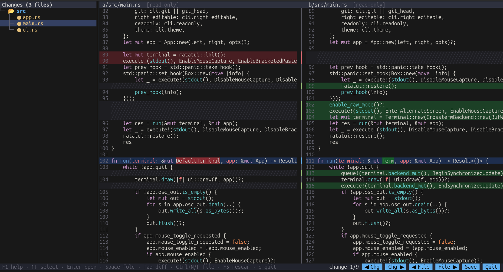

# tuidiff

A side-by-side terminal diff and merge editor.

A terminal side-by-side diff viewer and editor for folders and files, usable as a `git difftool -d` backend.



- A folder tree on the left shows only files that differ, drawn with Unicode tree guides (`├─ └─ │`) and folder icons.
  - `●` means modified, `✚` only on the right, `✖` only on the left, `➜` renamed with identical content, and `✔` identical after your edits. Renamed files (also with edits, when at least half the content matches) are paired automatically and show `← old path`; use `--no-renames` to turn this off. `✎` marks unsaved changes.
- Two diff panes show the old and new versions with aligned lines, syntax highlighting (syntect), and highlighted changed words within a line.
- A built-in modeless editor provides undo/redo, selection and a clipboard. Edits recompute the diff live.
- You can copy a change from one side to the other with Meld-style `«` / `»` arrows or `Alt+←/→`.
- Full mouse support: clicks, drag-selection, double-click word selection, wheel scrolling, scrollbars, clickable change arrows and buttons, and draggable tree and pane splitters.

## Donation

If you like this project and want to support its development, you can donate via:

- GitHub Sponsor: https://github.com/sponsors/asfernandes
- Pix (Brazil): 278dd4e5-8226-494d-93a9-f3fb8a027a99
- BTC: 1Q1W3tLD1xbk81kTeFqobiyrEXcKN1GfHG
- [](https://www.paypal.com/cgi-bin/webscr?cmd=_s-xclick&hosted_button_id=X3JMTGW92LQEL)

## Usage

```
tuidiff <LEFT> <RIGHT>          # two folders or two files
tuidiff .                       # inside a git repo: HEAD vs. working tree (like `git difftool -d HEAD`)
tuidiff <REV1>..<REV2> [PATH]   # inside a git repo: two commits (read-only); `...` uses the merge base
tuidiff --git <LOCAL> <REMOTE>  # git mode
tuidiff --list-themes
tuidiff --theme "Solarized (dark)" a b
```

### As git difftool

```
git config --global difftool.tuidiff.cmd 'tuidiff --git "$LOCAL" "$REMOTE"'
git config --global difftool.prompt false
git config --global diff.tool tuidiff        # optional: make it the default

git difftool -d               # folder diff of the working tree vs. the index/HEAD
git difftool -d HEAD~3        # working tree vs. a commit
git difftool -d main feature  # two commits (read-only)
git difftool                  # file-by-file mode also works
```

Which files can be edited:

| Situation | Left | Right |
|---|---|---|
| Plain folder/file diff | editable | editable |
| git, right side is the working tree | read-only | **editable**: with symlinks saved straight into your working tree; with `--no-symlinks` (the default on Windows) saved to git's temp copy, which git copies back when the tool exits |
| git, right side is a commit (`git difftool -d main feature`) | read-only | editable, but git discards the edits when the tool exits |
| `tuidiff REV1..REV2` | read-only | read-only (both sides are commits) |

`--git` is auto-detected when the paths are inside a `git-difftool.*` temp dir. `--right-editable` forces the right side editable (e.g. for `tuidiff REV1..REV2`).

## Keys

| Where | Key | Action |
|---|---|---|
| global | `Tab` / `Shift+Tab` / `F6` | switch focus between tree, left and right (in an editable pane, `Tab` indents) |
| global | `Ctrl+D` / `Ctrl+E` (or `Alt+↓` / `Alt+↑`) | next / previous change |
| global | `Alt+→` / `Alt+←` | copy the change under the cursor left→right / right→left |
| global | `Alt+Shift+→` / `Alt+Shift+←` | move the divider between the left and right panes |
| global | `Ctrl+N` / `Ctrl+P` | next / previous file |
| global | `Ctrl+S` / `F2` | save the current file pair / save all |
| global | `Ctrl+Z` / `Ctrl+Y` | undo / redo |
| global | `F1` | show all keys by section |
| global | `F5` | rescan folders |
| global | `F12` | toggle mouse capture (turn it off to use the terminal's own text selection) |
| global | `Ctrl+Q` | quit; asks first if anything is unsaved |
| tree | `↑↓` `PgUp/PgDn` `Home/End` | select (opens the file) |
| tree | `Enter` / `→` / `←` / `Space` | focus the diff or expand / expand / collapse or go to parent / fold |
| tree | `Ctrl+←/→` | resize the tree |
| tree | `q` / `Esc` | quit |
| pane | arrows, `Ctrl+←/→`, `Home/End`, `Ctrl+Home/End`, `PgUp/PgDn` | move (hold `Shift` to select) |
| pane | `Ctrl+↑/↓` | scroll without moving the cursor |
| pane | `Ctrl+A` / `Ctrl+C` / `Ctrl+X` / `Ctrl+V` | select all / copy / cut / paste. With no selection, copy and cut take the whole line. Copy also goes to the system clipboard (natively, plus OSC 52 as a fallback). Some terminals intercept `Ctrl+Shift+C`; use `Ctrl+C` |
| pane | `Ctrl+K` / `Ctrl+Backspace` / `Ctrl+Del` | delete line (or selected lines) / previous word / next word |
| pane | `Ctrl+F` / `Ctrl+G` | find (plain text, case-insensitive; prefilled from the selection) / find next, wrapping at the end |
| pane | `Esc` | back to the tree |

Mouse: click a tree row to open a file or fold a folder. Click or drag in a pane to place the cursor or select, and double-click to select a word. The mouse wheel scrolls; hold `Shift` to scroll sideways. Click or drag the scrollbar of the tree or a pane to scroll it (both panes share one scroll position). Click `«` / `»` to copy a change, drag the tree border to resize it, drag the divider between the panes to resize them (double-click it to go back to 50:50), and use the status-bar buttons.

## Build

```
cargo build --release   # needs a C compiler (bundled Oniguruma regex engine for highlighting)
cargo test
```

## License

MIT. See [LICENSE](LICENSE).
